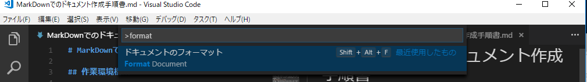

# MarkDownでのドキュメント作成手順書

- [MarkDownでのドキュメント作成手順書](#markdown%E3%81%A7%E3%81%AE%E3%83%89%E3%82%AD%E3%83%A5%E3%83%A1%E3%83%B3%E3%83%88%E4%BD%9C%E6%88%90%E6%89%8B%E9%A0%86%E6%9B%B8)
	- [作業環境構築](#%E4%BD%9C%E6%A5%AD%E7%92%B0%E5%A2%83%E6%A7%8B%E7%AF%89)
		- [Visual Studio Codeのインストール](#visual-studio-code%E3%81%AE%E3%82%A4%E3%83%B3%E3%82%B9%E3%83%88%E3%83%BC%E3%83%AB)
		- [拡張機能のインストール](#%E6%8B%A1%E5%BC%B5%E6%A9%9F%E8%83%BD%E3%81%AE%E3%82%A4%E3%83%B3%E3%82%B9%E3%83%88%E3%83%BC%E3%83%AB)
	- [ドキュメント作成](#%E3%83%89%E3%82%AD%E3%83%A5%E3%83%A1%E3%83%B3%E3%83%88%E4%BD%9C%E6%88%90)
		- [MarkDownでドキュメントを作成する](#markdown%E3%81%A7%E3%83%89%E3%82%AD%E3%83%A5%E3%83%A1%E3%83%B3%E3%83%88%E3%82%92%E4%BD%9C%E6%88%90%E3%81%99%E3%82%8B)
		- [便利なコマンド](#%E4%BE%BF%E5%88%A9%E3%81%AA%E3%82%B3%E3%83%9E%E3%83%B3%E3%83%89)
			- [Format Document](#format-document)
			- [Markdown: Create Table of Contents](#markdown-create-table-of-contents)
	- [他のファイル形式に変換](#%E4%BB%96%E3%81%AE%E3%83%95%E3%82%A1%E3%82%A4%E3%83%AB%E5%BD%A2%E5%BC%8F%E3%81%AB%E5%A4%89%E6%8F%9B)
	- [補足](#%E8%A3%9C%E8%B6%B3)

## 作業環境構築

### Visual Studio Codeのインストール

[ここ](https://code.visualstudio.com/)の**Download for Windows**からダウンロードしてインストール

### 拡張機能のインストール

| 拡張機能                                                                                                                               | 説明                                                       |
| -------------------------------------------------------------------------------------------------------------------------------------- | ---------------------------------------------------------- |
| [Japanese Language Pack for Visual Studio Code](https://marketplace.visualstudio.com/items?itemName=MS-CEINTL.vscode-language-pack-ja) | 日本語化。Visual Studio Codeの初回起動時に勧められるはず。 |
| [Markdown All in One](https://marketplace.visualstudio.com/items?itemName=yzhang.markdown-all-in-one)                                  | MarkDownを編集するのに便利な機能が色々入っている           |
| [Auto-Open Markdown Preview](https://marketplace.visualstudio.com/items?itemName=hnw.vscode-auto-open-markdown-preview)                | MarkDownファイルを開くと自動でプレビューが表示される       |
| [markdownlint](https://marketplace.visualstudio.com/items?itemName=DavidAnson.vscode-markdownlint)                                     | MarkDownの文法チェックを行う                               |
| [Markdown PDF](https://marketplace.visualstudio.com/items?itemName=yzane.markdown-pdf)                                                 | MarkDownをPDFに変換する                                    |

## ドキュメント作成

### MarkDownでドキュメントを作成する  

この手順書のMarkDownは[ここ](https://github.com/pon3939/Manual)にあります

### 便利なコマンド

F1キーを押してコマンドを入力すると実行できます

#### Format Document

ファイル全体をフォーマットする

#### Markdown: Create Table of Contents

良い感じに目次を作ってくれる  
見出しを編集すると目次も併せて変更してくれる

## 他のファイル形式に変換

**Markdown PDF: Export (任意のファイル形式)** コマンドで変換する  
画像も1ファイルにまとめられるので、PDFのほうがオススメ

## 補足

設定の **markdown-pdf.styles** で任意のスタイルシートを使用可能  
**markdown-pdf.includeDefaultStyles** でデフォルトのスタイルシートを無効にできる
