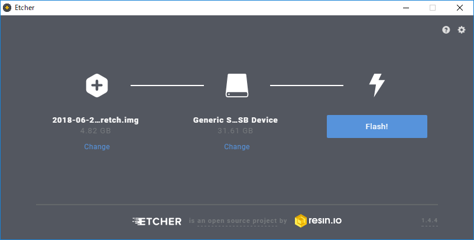

# Raspberry Piセットアップ手順書

- [Raspberry Piセットアップ手順書](#raspberry-pi%E3%82%BB%E3%83%83%E3%83%88%E3%82%A2%E3%83%83%E3%83%97%E6%89%8B%E9%A0%86%E6%9B%B8)
	- [環境](#%E7%92%B0%E5%A2%83)
	- [OSインストール](#os%E3%82%A4%E3%83%B3%E3%82%B9%E3%83%88%E3%83%BC%E3%83%AB)
		- [Etcherインストール](#etcher%E3%82%A4%E3%83%B3%E3%82%B9%E3%83%88%E3%83%BC%E3%83%AB)
		- [ダウンロード](#%E3%83%80%E3%82%A6%E3%83%B3%E3%83%AD%E3%83%BC%E3%83%89)
		- [インストール](#%E3%82%A4%E3%83%B3%E3%82%B9%E3%83%88%E3%83%BC%E3%83%AB)
		- [動作確認](#%E5%8B%95%E4%BD%9C%E7%A2%BA%E8%AA%8D)
	- [初期設定](#%E5%88%9D%E6%9C%9F%E8%A8%AD%E5%AE%9A)
	- [samba](#samba)

## 環境

- 本体はRaspberry Pi Zero W
- OSはSDカードにインストール

## OSインストール

### Etcherインストール

SDカードにイメージをインストールするために[Etcher](https://etcher.io/)をインストールする  

### ダウンロード

[ラズベリーパイ財団の公式ホームページ](https://www.raspberrypi.org/downloads/)からRASPBIANをダウンロードする  
FULL版とLITE版があるが、FULL版をダウンロードする

### インストール

ダウンロードしたイメージを解凍して、Etcherでイメージをインストールする  


### 動作確認

SDカードをラズパイに挿して起動する  
無事起動すればOK

## 初期設定

初期設定をするか聞かれるので`Next`をクリック

- 国はJapanを選択
- Password変更
- 接続するWiFiを選択
- アップデートを確認

メニュー → 設定 → Raaspberry Piの設定 から下記設定

- システム
	- ブート：CLI
- インターフェイス
	- SSH：有効

全部終わったら再起動する  
再起動後、下記のコマンドを実行する

```bash
sudo apt update
sudo apt upgrade
sudo apt install -y \
	jfbterm \
	ttf-kochi-gothic \
	uim \
	uim-anthy \
	vim \
	xfonts-intl-japanese \
	xfonts-intl-japanese-big \
	xfonts-kaname

sudo vi /etc/hostname

------------------------------
好きなホスト名を入力
------------------------------

sudo vi /etc/hosts

------------------------------
127.0.1.1	{/etc/hostnameに入力したホスト名}
------------------------------

sudo vi /etc/vim/vimrc

------------------------------
set nocompatible
syntax on
------------------------------

vi ~/.vimrc

------------------------------
set mouse-=a
------------------------------

sudo vi /root/.vimrc

------------------------------
set mouse-=a
------------------------------

sudo reboot
```

以降はsshで接続可能

## samba

下記を実行

```bash
sudo apt install -y samba
sudo mkdir /home/share
sudo chmod 777 /home/share
sudo vi /etc/samba/smb.conf

------------------------------
unix charset = UTF-8
dos charset = CP932

interfaces = 192.168.11.0/24
bind interfaces only = yes

load printers = no
disable spoolss = yes
printing = bsd

[share]
	path           = /home/share
	writable       = yes
	guest ok       = yes
	guest only     = yes
	create mode    = 0777
	directory mode = 0777
	share modes    = yes
------------------------------

sudo systemctl restart smbd nmbd
sudo systemctl enable smbd nmbd
```
